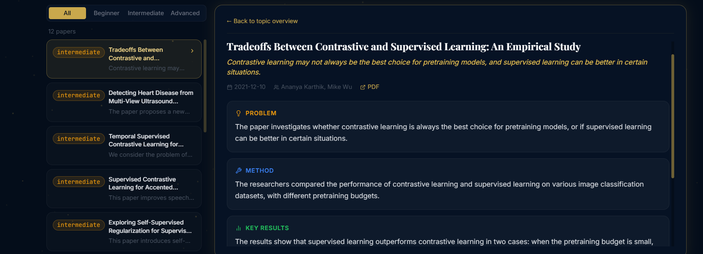
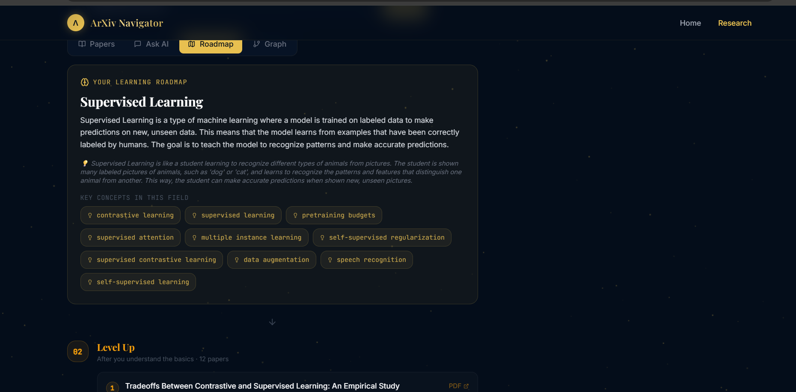
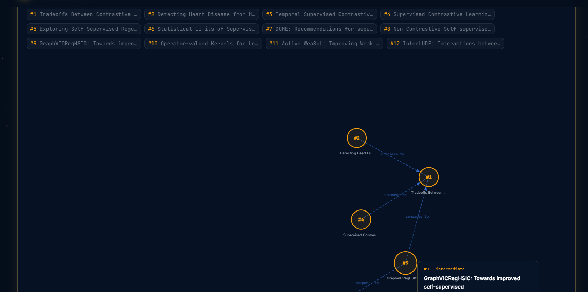

[README.md](https://github.com/user-attachments/files/29408158/README.md)
# ArXiv Navigator: ML Research Intelligence

 **Enter a topic. ArXiv pulls the papers. The AI reads, ranks, synthesises  and maps the entire field for you.**


## What it does

Most students searching ML topics get overwhelmed, hundreds of papers, no idea where to start, no context on how they connect. ArXiv Navigator solves this by turning raw research into a structured, beginner-friendly intelligence dashboard.


## Live Demo

🔗 **Frontend:** [arxiv-navigator-omega.vercel.app](https://arxiv-navigator-omega.vercel.app)  
🔗 **Backend API:** [arxiv-navigator.onrender.com](https://arxiv-navigator.onrender.com/docs)  
📁 **GitHub:** [github.com/mitvanshika/arxiv-navigator](https://github.com/mitvanshika/arxiv-navigator)


## Features

### 🎯 4-Step Agentic Pipeline


User enters topic
      ↓
① ArXiv API fetches & ranks papers by relevance (scored 1–10)
      ↓
② LLM generates plain-English topic overview with analogy
      ↓
③ Per-paper structured extraction: Problem · Method · Results · Why it matters
      ↓
④ Cross-paper relationship mapping: builds on · compares to
```

Each step runs sequentially with a live progress indicator — users watch the pipeline run in real time.


###  Paper Intelligence Cards

Every paper is broken down into:
- **Problem** — what specific issue the paper solves (plain English)
- **Method** — how they solved it (no jargon)
- **Key Results** — specific findings and numbers
- **Why it matters** — one sentence a student can understand
- **Difficulty badge** — Beginner / Intermediate / Advanced
- **Relevance score** — 10/10 down to 1/10 based on ranking




###  Self-Healing RAG Chatbot

A retrieval-augmented generation system that answers questions about the fetched papers.

**The self-healing mechanism:**
1. User asks a question
2. System retrieves relevant paper content
3. LLM generates an answer
4. A second LLM call judges if the answer is good
5. If bad → query is automatically reframed and retrieval retries
6. Final answer shown with source papers cited

This isn't a standard RAG — the system actively monitors its own output quality and corrects itself.


---

 Learning Roadmap

Auto-generated learning path sorted by difficulty:

```
YOUR LEARNING ROADMAP
        ↓
01 START HERE    ← Beginner papers (foundational, no prior ML needed)
        ↓
02 LEVEL UP      ← Intermediate papers (assumes basic ML knowledge)
        ↓
03 DEEP DIVE     ← Advanced papers (cutting-edge, high complexity)
```

Each paper shows its one-line summary, key concepts, and a direct PDF link.



---

### Paper Relationship Graph

Interactive D3.js force graph showing how papers relate to each other:
- **Solid lines** — "builds on" relationships
- **Dashed lines** — "compares to" relationships
- **Colour-coded nodes** — Green (beginner) / Amber (intermediate) / Red (advanced)
- Hover for paper title and summary
- Fully draggable and interactive



---

###  Intelligent Caching

Every Groq API call result is cached to disk:
- Same topic searched twice → instant load, zero API calls
- Survives server restarts
- Scales to many users without burning quota

---

###  Search History

Dropdown under the search bar shows recent searches (stored in localStorage). Click any to instantly reload cached results.

---
### Feedback Analysis Dashboard 

After every AI answer in the chat, users can rate responses with 👍 or 👎. The system tracks:
- Which topics produce high quality answers vs poor ones
- Answer quality trends over time  
- Most commonly asked questions per topic

This creates a feedback loop that surfaces where the RAG pipeline needs improvement, turning the app into a self-improving research system.

## Tech Stack

| Layer | Technology |
|---|---|
| Frontend | React 18 + Vite + Tailwind CSS |
| Animations | Framer Motion (physics-based floating chips, 3D card tilt, parallax title) |
| Visualisation | D3.js force-directed graph |
| Backend | FastAPI + Uvicorn |
| LLM | Groq API — llama-3.1-8b-instant |
| Paper Retrieval | ArXiv Python API |
| Caching | JSON file-based disk cache |
| Deployment | Vercel (frontend) + Render (backend) |

---

## Architecture

```
arxiv-navigator/
├── backend/
│   ├── main.py                  # FastAPI routes + caching logic
│   └── core/
│       ├── fetcher.py           # ArXiv API + relevance scoring
│       ├── parser.py            # PDF parsing + chunking
│       ├── rag_gemini.py        # Self-healing RAG pipeline
│       └── concepts_gemini.py   # LLM enrichment + relationship extraction
└── frontend/
    └── src/
        ├── pages/
        │   ├── LandingPage.jsx  # Animated hero + physics chips
        │   └── ResearchPage.jsx # Split-screen research dashboard
        └── components/
            ├── PaperCard.jsx        # Structured paper breakdown
            ├── ChatInterface.jsx    # Self-healing RAG chat UI
            ├── Roadmap.jsx          # Learning path visualisation
            ├── KnowledgeGraph.jsx   # D3 relationship graph
            ├── Navbar.jsx
            └── StarField.jsx        # Canvas star animation
```

---

## What Makes It Stand Out

**Self-healing RAG** — most RAG systems just retrieve and answer. This one checks its own answer quality and retries with a reframed query if it fails. This is agentic behaviour — the system corrects itself.

**Relationship extraction** — instead of just summarising individual papers, the system uses the LLM to identify cross-paper relationships (which papers build on or compare to which). This produces a genuine research map, not just a list.

**Difficulty classification** — the LLM reads each paper and classifies it as beginner/intermediate/advanced based on actual content, not metadata. This lets students find their entry point into any research area.

**Physics-based UI** — the landing page chips float with real velocity and momentum, repel from the cursor, and wrap around the screen. Built with Framer Motion and requestAnimationFrame.

---

## Local Setup

```bash
# Backend
cd backend
pip install -r requirements.txt
# Add GROQ_API_KEY to backend/.env
uvicorn main:app --reload --port 8000

# Frontend
cd frontend
npm install
npm run dev
```

Open `http://localhost:5173`

---

## Built by

**Vanshika Mittal** — 2nd year B.Tech CS, GTBIT (GGSIPU)  
Agentic AI Intern @ Genpact · GDG On Campus Member  
[github.com/mitvanshika](https://github.com/mitvanshika)
